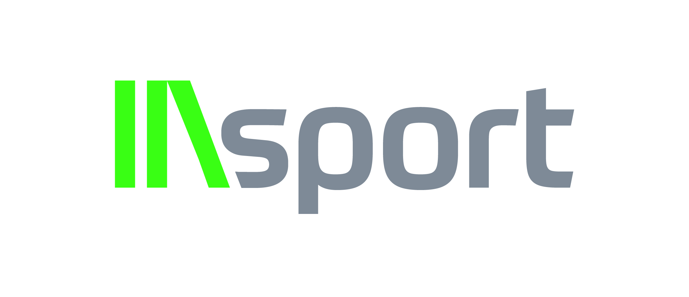

<div align="center">



# IAsport

Workspace web e design system para criação de imagens esportivas com IA.

</div>

Este repositório reúne a base técnica do IAsport: aplicação web em React/Vite,
design system compartilhado, API Express, contrato OpenAPI, validações Zod,
persistência com Drizzle/PostgreSQL e ferramentas para desenvolvimento
local em macOS, Linux e Windows.

> [!NOTE]
> O projeto está em evolução. Os comandos e módulos abaixo descrevem o estado
> atual do workspace; uma validação local não equivale a deploy ou prova de
> produção.

## Comece por aqui

Requisitos: Node.js 24 e pnpm 11.17.0 via Corepack.

```bash
corepack pnpm install --frozen-lockfile
pnpm run typecheck
PORT=5000 BASE_PATH=/ pnpm run build
```

Para iniciar a aplicação web:

```bash
pnpm --filter @workspace/r9-app run dev
```

Para iniciar a API:

```bash
pnpm --filter @workspace/api-server run dev
```

## O que existe no workspace

| Diretório | Responsabilidade |
| --- | --- |
| `artifacts/r9-app` | Aplicação web principal em Vite/React |
| `artifacts/iasport` | Tokens, componentes e preview do design system |
| `artifacts/api-server` | API Express e processamento no servidor |
| `artifacts/mockup-sandbox` | Prototipação visual com o design system |
| `lib/api-spec` | Contrato OpenAPI e geração de código |
| `lib/api-client-react` | Cliente React gerado |
| `lib/api-zod` | Schemas e tipos Zod gerados |
| `lib/db` | Schema Drizzle e integração PostgreSQL |
| `scripts` | Automação e gates locais de compatibilidade |

## Desenvolvimento

Comandos de validação disponíveis na raiz:

```bash
pnpm run verify:native
pnpm run smoke:web
pnpm run test:compat
pnpm run typecheck
PORT=5000 BASE_PATH=/ pnpm run build
```

O contrato da API vive em `lib/api-spec/openapi.yaml`. Após mudanças no
contrato, regenere os artefatos:

```bash
pnpm --filter @workspace/api-spec run codegen
```

O design system usa `artifacts/iasport/tokens.json` como fonte de verdade:

```bash
pnpm --filter @workspace/iasport run tokens
```

Leia os guias de consumo antes de alterar uma interface:

- [Desenvolvimento web multiplataforma](docs/development/cross-platform-web.md)
- [Consumo web do design system](artifacts/iasport/docs/consuming-web.md)
- [Consumo Expo do design system](artifacts/iasport/docs/consuming-expo.md)
- [Referências visuais e de marca](artifacts/iasport/docs/references/README.md)

## Banco e ambiente

O banco usa PostgreSQL com Drizzle ORM. O schema está em
`lib/db/src/schema/`. O comando abaixo exige `DATABASE_URL` e pode alterar o
banco apontado:

```bash
pnpm --filter @workspace/db run push
```

Mantenha variáveis e credenciais em arquivos locais não versionados. Nenhuma
implantação, migration remota ou integração de produção é presumida apenas por
existir um script local.

## Documentação para agentes

Consulte [`AGENTS.md`](AGENTS.md) antes de trabalhar no repositório. Ele contém
as regras de colaboração, fronteiras de segurança, comandos por pacote,
orientações do design system e critérios para relatar validações.

## Estado e próximos passos

O próximo passo natural é escolher qual superfície do MVP deve receber a
próxima rodada de implementação: app web, API de geração ou experiência
visual do design system.
